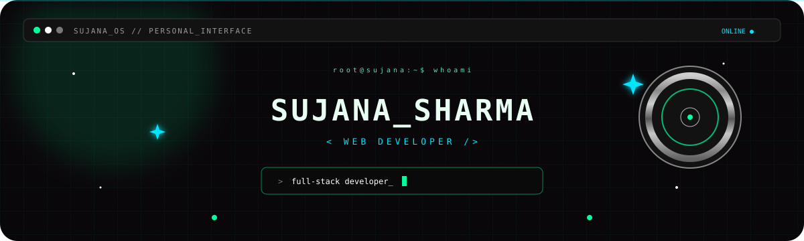

 

`✦ COMPUTER ENGINEERING` &nbsp;&nbsp;
`✦ PYTHON DEVELOPER` &nbsp;&nbsp;
`✦ FULL-STACK`

 

---

## 💿 ABOUT SUJANA

---

## 🪩 THE STACK

 

### LANGUAGES

`Python` `JavaScript`

### BACKEND

`Django` `Django REST Framework`

### FRONTEND

`React` `Vite` `Tailwind CSS` `Framer Motion`

### DATA / AUTOMATION

`Pandas` `BeautifulSoup` `Playwright` `schedule`

### DATABASES / OTHER

`PostgreSQL` `SQLite` `WebSockets` `REST APIs` `Git`

---

## 💗 PROJECT ARCHIVE

 

### `01` — 🎯 Lead Scoring Automation

A Django dashboard built around **time-decay lead scoring**.

It started as a Python script and grew into a system with exponential decay, a 30-day half-life, compound bonuses, CSV uploads, filtering, and a results interface.

`Python` `Django` `Pandas`

---

### `02` — 🛍️ FashionHub

A Django e-commerce application with cart, checkout, product reviews, authentication, password reset, order history, and **eSewa sandbox payments**.

`Django` `PostgreSQL` `eSewa`

---

### `03` — 💬 HelloThere

A real-time chat application with a Django Channels backend and React frontend.

Built around WebSockets and persistent real-time communication.

`Django Channels` `React` `WebSockets`

---

### `04` — 📚 Bookify

A book recommendation system using **TF-IDF + cosine similarity** to discover books with similar content.

`Python` `scikit-learn`

---

### `05` — 🎮 Neon Surge

A browser game released on CrazyGames with platform SDK integration.

`JavaScript` `Game Development`

---

### `06` — 🧩 AI Comment Assistant

A Chrome extension exploring AI-assisted intent filtering and automated browser workflows.

Uses Gemini to classify potential comment opportunities and interact with dynamically rendered content.

`JavaScript` `Chrome Extension` `Gemini API`

---

## 🪩 A LITTLE MORE ABOUT ME

`♡ building` &nbsp;&nbsp;
`✦ experimenting` &nbsp;&nbsp;
`♡ debugging` &nbsp;&nbsp;
`✦ learning`

  

---

## 📡 FIND ME

 

 

made with ♡, a lot of chiya coffe

